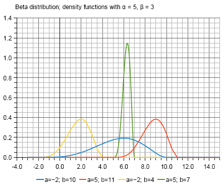

# Teilaufgabe Schüler Gierer

\textauthor{Janik Gierer}

Dieses Kapitel wird oft auch als _Literaturrecherche_ bezeichnet. Da gehört alles rein was der __normale__ Leser braucht um den praktischen Ansatz zu verstehen. Das bedeutet Sie brauchen einen roten Faden !

Das sind z.B: allgemeine Definitionen, Beschreibung von fachspezifischen Vorgehensweisen, Frameworks, Theorie zu verwendeten Algorithmen, besondere Umstände, ...

Es werden hier die Theoretischen und Praktischen Grundlagen zur Umsetztung von Home Assistant für ein Modelhaus gelegt und wie diese auch im echten Leben auf ein richtiges Haus angewendet werden können. Es wird das nötige Wissen dargestellt damit der Leser den praktischen teil nachvollziehen und verstehen kann. der fokus liegt hierbei auf der einrichtung des Dockers auf dem Raspberry Pi, der Kommunikation zwischen dem raspberry Pi und der Kommunikation zwischen Arduino Uno und Aktoren wie Sensoren.

### Verwendete Aktoren

- 100Pcs 1/4W 5% Toleranz 150Ohm Wiederstand
- 3mm Leuchtdioden

### Zusätlich Benötigtes

- IWILCS Dupont Crimp Set 790tlg inkl. Crimpzange
- Kabel 0,5mm²
- 4x PLA Basic Hellgrau (10104)
- 2x PLA Basic Dunkelgrau (10105)

### Verwendete Frameworks

- **Home Assistant**
    Dient als zentrales Steuerelement des Modelhauses. Es wird Praxisnahe simuliert wie man von einem Zentralen Standort sämtliche Geräte ansteuern und bedienen kann. 
- **Node-RED**
    Ermöglich die einfache erstellung und Automatisierung von Logik. Eingänge von Sensoren (Temperatur, Helligkeit) können eingelesen, verarbeitet werden und Aktoren entsprechend Angesteuert werden.  
- **MQTT**
    Wird als Kommunikationsprotokoll zwischen Mikrokontroller(Arduino Uno), dem Raspberry Pi und Home Assistant verwendet. Es sorgt für eine zuverlässige und schnelle Datenübermittlung.
- **Portainer**  
    Dient zur übersichtlichen verwaltung aller laufenden Docker-Container. Über das Webinterface können so Container leicht gestartet, gestoppt oder neu konfiguriert werden. 

# Teilaufgabe – Smart-Home-Umsetzung mit Home Assistant und Node-RED

**Schüler:** Janik Gierer

---

## 1. Theoretische Grundlagen
    Ein SmartHome beschreibt ein vernetztes Haus bei dem bestimmte meist alltägliche Komponenten von einem einzelnen Punkt aus gesteuert und ausgelesen werden können dies passiert entweder automatisch oder oder per Benutzereingabe. Beispiele dafür wären per Handy das Licht oder die Heizung ein/aus zu stellen oder ab einer bestimmten Uhrzeit die Rollläden automatisch nach unten zu fahren. Dafür werden im beispiel dieser Diplomarbeit ein Arduino als Mikrocontroller, ein raspberry Pi als Steuerzentrale sowie im konkreten Bereich Home Assitant als Automatisierungsplattform zum Einsatz Dadurch wird die Kommunikation zwischen Sensoren und Aktoren gewährleistet und die Steuerlogik wird mittels MQTT übertragen.
### 1.1 Sensorik, Aktorik und Steuerung im Modellhaus
*Grundlagen der Erfassung und Steuerung über Arduino und MQTT*

#### 1.1.1 Sensoren zur Messung von Umweltparametern
Temperatur, Helligkeit, Bewegung und deren Bedeutung im Smart Home

#### 1.1.2 Aktoren zur Steuerung von Licht und Geräten
Relais, LEDs, Mini-Lampen – Einsatzmöglichkeiten und Grenzen

#### 1.1.3 Mikrocontroller (Arduino) als Basis für smarte Funktionen
Programmierbare Steuerzentrale für Sensoren und Aktoren

---

### 1.2 Datenübertragung und Kommunikation im Smart Home

#### 1.2.1 MQTT als zentrales Protokoll zwischen Arduino und Home Assistant
Topic-Struktur, Payload-Formate, Zuverlässigkeit

#### 1.2.2 Node-RED zur Verarbeitung und Weiterleitung von Nachrichten
Visuelle Programmierung zur Automatisierung

#### 1.2.3 Serieller Zugriff auf den Arduino vom Raspberry Pi
Verbindung über `/dev/ttyACM0` für Steuerkommandos

---

### 1.3 Home Assistant als zentrale Steuereinheit

#### 1.3.1 Integration von MQTT-Geräten in Home Assistant
Manuelle Konfiguration vs. Auto-Discovery

#### 1.3.2 Automationen in Home Assistant
Lichtsteuerung bei Bewegung, Temperaturregelung usw.

---

### 1.4 Visualisierung und Benutzeroberfläche

#### 1.4.1 Lovelace UI zur Darstellung von Geräten und Zuständen
Dashboards für Licht, Heizung, Fensterstatus etc.

#### 1.4.2 Visualisierung von Zustandsänderungen
Lampenstatus, Temperaturverläufe, Türkontakte

---

## 2. Praktische Umsetzung

### 2.1 Aufbau des Modellhauses

#### 2.1.1 Stromversorgung und Verkabelung
Mini-USB, Breadboards, Steckverbindungen

#### 2.1.2 Einbau von LEDs, Relais und Temperatursensoren
Platzierung und Verkabelung im Hausmodell

---

### 2.2 Arduino-Programmierung

#### 2.2.1 Programm zum Einlesen und Senden von Sensorwerten
z. B. Temperatur via Serial/MQTT senden

#### 2.2.2 Empfang und Ausführung von Steuerkommandos
Licht EIN/AUS über Serial empfangen

---

### 2.3 Node-RED Workflows zur Kommunikation

#### 2.3.1 MQTT-IN zur Verarbeitung von Home-Assistant-Kommandos
z. B. `haus/licht/wohnzimmer` → Serial

#### 2.3.2 Serial-Out an den Arduino
Steuerung der Lichter via USB-Port

---

### 2.4 Docker-basierter Betrieb

#### 2.4.1 Container für Home Assistant, Node-RED, MQTT und Portainer
Verwaltet über `docker-compose` am Raspberry Pi
Es wird am Raspberry Pi eine `docker-compose.yaml` Datei erstellt 1-.,mn 
 

---

### 2.5 Bedienung und Steuerung

#### 2.5.1 Steuerung über Smartphone, Tablet und PC
Zugriff auf Home Assistant UI im Browser

#### 2.5.2 Test der Licht- und Heizungssteuerung

---

### 2.6 Fehleranalyse und Optimierungen

#### 2.6.1 Serielle Fehler und Verbindungsprobleme
Behandlung von *Permission Denied* und Portproblemen

#### 2.6.2 MQTT-Verbindungsabbrüche und Topics
Vermeidung durch QoS und LWT

---

## 2.7 Ausblick

### 2.7.1 Erweiterung mit Sprachsteuerung (z. B. Alexa)
### 2.7.2 Erweiterung auf mehrere Räume oder Wohnungen
### 2.7.3 Einbindung weiterer Sensoren (CO₂, Luftqualität, Helligkeit)

## Praktische Arbeit

> Hier beschreiben Sie ihren praktischen Teil. Es geht darum seine Implementierung / Versuche so darzustellen dass anhand dieser dre Leser erkennen kann was sie wie gemacht haben.

Die Frage nach der Detailgenauigkeit lässt sich wie folgt beantworten: So, dass man Ihre Aufgabenstellung vollständig  nachvollziehen kann wenn man nur diese Diplomarbeit in Händen hat!

### Messergebnisse

{width=70%}

Bilder sind so scharf wie möglich darzustellen. Unnötige Dinge (welche für den Leser keine Information liefern) sind wegzuschneiden. Üblicherweise versucht das Framework Bilder möglichst gut und vollflächig in die Seite einzupassen - was aber speziell bei kleinen Bildern keinen Sinn macht. Daher kann man die Breite des Bildes `{width=xx%}` beeinflussen. Generell macht es keinen Sinn reisen Bilder mit dieser Funktion niederzuskalieren, sondern eher die Bilder schon vorher mittels eines Bildbearbeitungsprogrammes niederzurechnen. Damit wird das endgültige PDF nicht so groß.

### Etwas Fliesstext

We'll put some happy little leaves here and there. Poor old tree. Have fun with it. Isn't that fantastic? You can just push a little tree out of your brush like that.

Making all those little fluffies that live in the clouds. If there's two big trees invariably sooner or later there's gonna be a little tree. There is no right or wrong - as long as it makes you happy and doesn't hurt anyone. Use absolutely no pressure. Just like an angel's wing. This is the time to get out all your flustrations, much better than kicking the dog around the house or taking it out on your spouse. I guess I'm a little weird. I like to talk to trees and animals. That's okay though; I have more fun than most people.

\todo{Noch weitere Infos einholen}

Do an almighty painting with us. Learn when to stop. Absolutely no pressure. You are just a whisper floating across a mountain. As trees get older they lose their chlorophyll. Clouds are free. They just float around the sky all day and have fun.

Now a hierarchical tree from this repo:

\dirtree{%
.1 ./.
.2 example.
.3 ....
.2 style.
.3 ....
.2 tools.
.3 docker.
.3 github.
.2 Jenkinsfile.
.2 Makefile.
.2 REAMDE.md.
}

A fan brush can be your best friend. Sometimes you learn more from your mistakes than you do from your masterpieces. You can bend rivers. But when I get home, the only thing I have power over is the garbage. Don't kill all your dark areas - you need them to show the light. There's nothing wrong with having a tree as a friend.

God gave you this gift of imagination. Use it. Use your imagination, let it go. Put your feelings into it, your heart, it's your world. There's not a thing in the world wrong with washing your brush. Happy painting, God bless. All those little son of a guns.

I sincerely wish for you every possible joy life could bring. Everybody needs a friend. That's crazy.

If you don't like it - change it. It's your world. Isn't it great to do something you can't fail at? Play with the angles. See how easy it is to create a little tree right in your world. This piece of canvas is your world. This painting comes right out of your heart.
