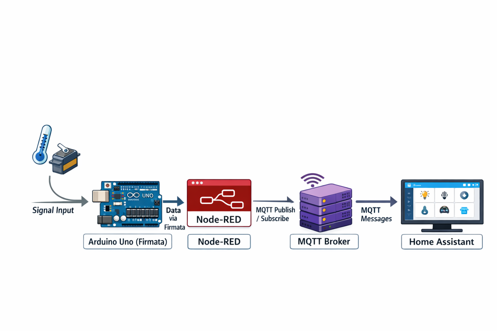
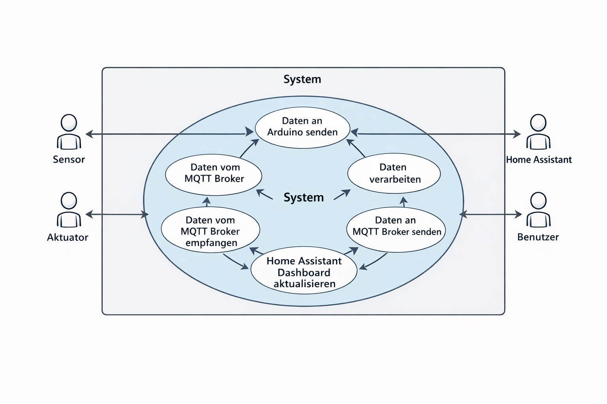
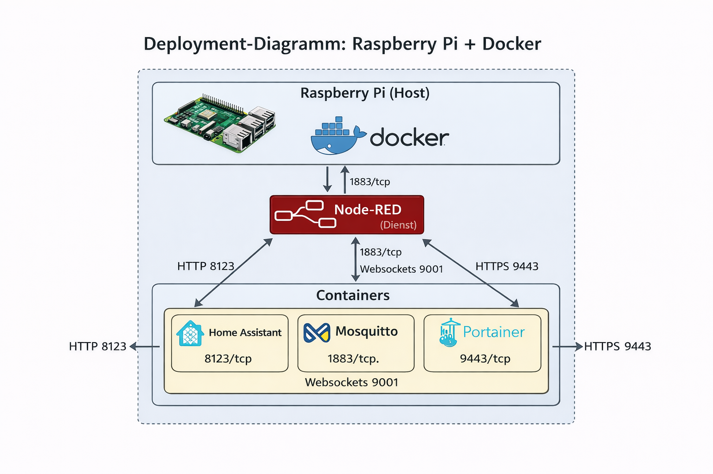
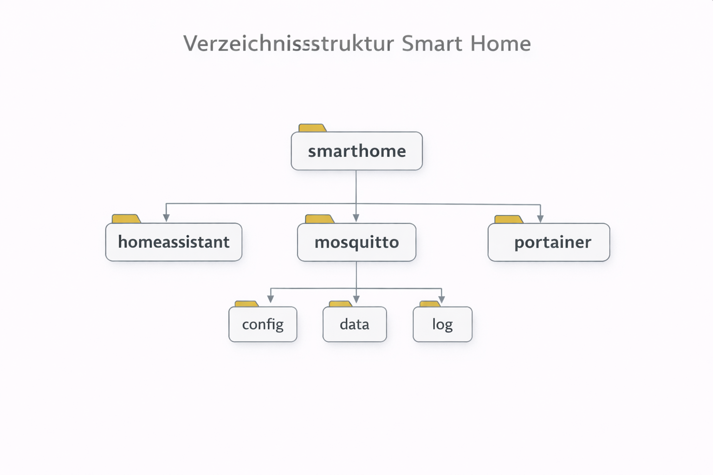

# Teilaufgabe Schüler Gierer

\textauthor{Janik Gierer}

Dieses Kapitel beschreibt die theoretischen Grundlagen sowie die bisher umgesetzten technischen Bausteine meines Teilprojekts innerhalb der Diplomarbeit. Der Schwerpunkt liegt auf dem Zusammenspiel von Home Assistant, Node-RED, MQTT, Docker und einem Arduino Uno in einem Smart-Home-Modellhaus. Es wird bewusst darauf geachtet, den Inhalt fachlich korrekt, nachvollziehbar und reproduzierbar darzustellen.

Ziel dieses Kapitels ist es, nicht nur einzelne Werkzeuge aufzulisten, sondern den Gesamtzusammenhang zu erklären: Welche Rolle übernimmt welche Komponente, wie werden Daten transportiert, wie werden Zustandsänderungen verarbeitet und wie wird daraus ein bedienbares, erweiterbares Smart-Home-System. [@ha_installation] [@nodered_homepage] [@oasis_mqtt_v5_2019]

## Einordnung und Ziel dieses Abschnitts

Der vorliegende Abschnitt ist eine Verbindung aus Literaturrecherche und technischer Dokumentation. Er soll einem fachlich interessierten Leser ermöglichen, den praktischen Teil logisch nachzuvollziehen, ohne vorauszusetzen, dass die konkrete Projektumgebung bereits bekannt ist.

Die Ausführungen decken drei Ebenen ab:

1. **Grundlagenebene:** Definitionen zu Smart Home, Sensorik, Aktorik und Steuerung.
2. **Architekturebene:** Aufbau des Gesamtsystems mit Raspberry Pi, Arduino, Node-RED, MQTT und Home Assistant.
3. **Umsetzungsebene:** Betriebs- und Konfigurationsschritte, die im Projekt bereits beschrieben wurden.

Die Inhalte sind so formuliert, dass keine zusätzlichen praktischen Ergebnisse behauptet werden, die nicht bereits Teil der bisherigen Projektarbeit sind.

Die zentrale Zielsetzung besteht darin, ein modulares und verständliches Smart-Home-System im Modellmaßstab zu realisieren, das typische Funktionen realer Hausautomation technisch korrekt abbildet. Dazu gehören die Erfassung von Umgebungsdaten, die Ausführung von Schaltaktionen sowie die sichtbare Darstellung der Systemzustände in einer Benutzeroberfläche.

Die Arbeit verfolgt nicht das Ziel, ein marktreifes Produkt zu entwickeln. Der Fokus liegt stattdessen auf:

- nachvollziehbarer Architektur,
- klar getrennten Verantwortlichkeiten der Systemkomponenten,
- robuster Kommunikation zwischen den beteiligten Diensten,
- guter Erweiterbarkeit für spätere Projektphasen.

Diese Abgrenzung ist wesentlich, damit Bewertung und Dokumentation auf denselben technischen Rahmenbedingungen basieren.

## Verwendete Komponenten

- 3-mm-LEDs als Lichtaktoren
- Widerstände (1/4 W, 5 % Toleranz, 150 Ohm) zur Strombegrenzung

Die LED-Kreise bilden die zentrale, sichtbare Aktorik im Modellhaus. Ihr Vorteil ist die klare Rückmeldung bei Schaltvorgängen: Jede Zustandsänderung ist direkt erkennbar und kann zusätzlich im Dashboard kontrolliert werden.

**Hinweis zur Auslegung:** Bei 5 V Betriebsspannung, einer typischen LED-Vorwärtsspannung von ca. 2 V und 150 Ohm Vorwiderstand liegt der Strom rechnerisch im Bereich von etwa 20 mA. Das ist für viele Mikrocontroller-Pins bereits nahe am sinnvollen Grenzbereich. Für einen stabilen Dauerbetrieb ist daher eine sorgfältige Stromverteilung wichtig, insbesondere wenn mehrere Kanäle gleichzeitig geschaltet werden.

Im Projektkontext werden folgende Sensorklassen betrachtet:

- Helligkeitssensoren,
- PIR-Bewegungssensoren,
- Temperatursensoren,
- Türkontakte.

Die Sensorik stellt die Datengrundlage für Automationen dar. Ohne konsistente, wiederholbar erfasste Eingangswerte ist eine reproduzierbare Steuerlogik nicht möglich.

Zusätzlich eingesetztes Material:

- Dupont-Crimp-Set inklusive Crimpzange
- Leitungen mit 0,5 mm2 Querschnitt
- PLA-Filament für den Modellhausaufbau (hellgrau und dunkelgrau)

Der Aufbau im Modellhaus hat einen didaktischen Vorteil: Leitungsführung, Kanalzuordnung und Schaltverhalten werden sichtbar. Dadurch kann die technische Funktion nicht nur softwareseitig, sondern auch mechanisch und elektrisch nachvollzogen werden.

## Verwendete Frameworks und Protokolle

**Home Assistant**

Home Assistant dient als zentrale Integrations- und Bedienplattform. Hier laufen Entitäten, Automationen und Dashboards zusammen. Damit entsteht ein einheitlicher Blick auf den Systemzustand. [@ha_installation] [@ha_automation]

Im Projekt ist Home Assistant besonders wichtig für:

- die Darstellung von Ist-Zuständen,
- die Auslösung manueller Schaltvorgänge,
- die Definition regelbasierter Automationen.

**Node-RED**

Node-RED wird als visuelle Verarbeitungsschicht eingesetzt. Datenflüsse können über Nodes modelliert, angepasst und nachvollzogen werden. Das erleichtert Iterationen während der Entwicklung deutlich, da Logikbausteine ohne kompletten Neuaufbau des Systems angepasst werden können. [@nodered_homepage]

Wesentliche Rolle von Node-RED im Projekt:

- Brücke zwischen serieller Kommunikation und MQTT,
- Validierung und Transformation von Payloads,
- geordnete Weitergabe von Befehlen und Statusmeldungen.

**MQTT**

MQTT wird als leichtgewichtiges Publish/Subscribe-Protokoll für den Nachrichtenaustausch zwischen Diensten eingesetzt. Der Einsatz ist vor allem bei verteilten Komponenten sinnvoll, weil Sender und Empfänger nicht direkt gekoppelt sein müssen. [@oasis_mqtt_v5_2019] [@agyemang_mqtt_2022] [@ha_mqtt_integration]

Typische Vorteile im vorliegenden Kontext:

- geringe Protokolloverheads,
- einfache Skalierung auf weitere Topics und Entitäten,
- klare Trennung von Kommando- und Statuskanälen.

**Portainer**

Portainer dient als Weboberfläche zur Verwaltung der Docker-Container. Das ist besonders hilfreich, wenn mehrere Dienste parallel betrieben und bei Bedarf einzeln neu gestartet, aktualisiert oder überwacht werden müssen. [@portainer_docs]

**Firmata**

Firmata ist ein standardisiertes Protokoll, mit dem ein Host-System (hier Raspberry Pi bzw. Node-RED) einen Mikrocontroller (Arduino Uno) über die serielle Schnittstelle ansteuern kann. [@arduino_firmata_docs] [@firmata_arduino_github]

Der praktische Nutzen liegt darin, dass keine vollständig eigene serielle Protokolldefinition implementiert werden muss. Stattdessen wird ein etablierter Standard genutzt.

## Smart-Home-Umsetzung mit Home Assistant und Node-RED

**Schüler:** Janik Gierer

**Architektur in drei Ebenen**

Das System kann in drei logisch getrennte Ebenen aufgeteilt werden:

1. **Feldebene (Arduino):** Direkte Anbindung von Sensorik und Aktorik.
2. **Verarbeitungsebene (Node-RED + MQTT):** Datenfluss, Protokollbrücke und Logikaufbereitung.
3. **Managementebene (Home Assistant):** Visualisierung, Automationen und Bedienung.

{ width=80% }

Diese Trennung erhöht die Wartbarkeit, weil Änderungen auf einer Ebene nicht automatisch alle anderen Ebenen brechen.

**Kommunikationspfad**

Im aktuellen Aufbau läuft die Kommunikation entlang eines klaren Pfades:

Sensor/Aktor <-> Arduino (I/O) <-> serielle Verbindung (Firmata) <-> Node-RED <-> MQTT-Broker <-> Home Assistant.

Damit ist fachlich sauber getrennt:

- **I/O-nahe Steuerung** auf Mikrocontroller-Ebene,
- **Nachrichtentransport und Aufbereitung** auf Middleware-Ebene,
- **Benutzerinteraktion und Regelwerk** auf Plattform-Ebene.

Technisch wichtig: In dieser Architektur ist MQTT nicht der direkte Transportweg vom Arduino Uno zu Home Assistant. Der Arduino ist primär seriell via Firmata angebunden; MQTT wird zwischen den Diensten auf dem Raspberry Pi genutzt. [@firmata_arduino_github] [@ha_mqtt_integration]

{ width=80% }

**Theoretische Grundlagen**

Ein Smart Home ist ein vernetztes System, in dem Sensorik, Aktorik und Steuerlogik zusammenwirken. Eingehende Daten werden ausgewertet und führen je nach Regelwerk zu Aktionen. Die Interaktion kann automatisch oder manuell über eine Benutzeroberfläche erfolgen. [@abutair_secure_privacy_smart_home_2020]

Für diese Arbeit bedeutet das konkret:

- Sensoren liefern Ereignisse bzw. Messwerte,
- die Logik entscheidet über Aktionen,
- Aktoren setzen diese Aktionen sichtbar um,
- die Plattform stellt alles nachvollziehbar dar.

Sensorik umfasst die strukturierte Erfassung physischer Zustände. Im Modellhaus sind das insbesondere Helligkeit, Bewegung, Temperatur und Türstatus. Jeder Sensortyp liefert dabei eine andere Datencharakteristik:

- kontinuierliche Werte (z. B. Temperatur).

Diese Unterschiede sind für die Auswertung relevant, da Triggerlogik und Entprellung je nach Signaltyp unterschiedlich gestaltet werden müssen.

Aktorik setzt digitale Steuerentscheidungen in physische Wirkung um. Im Projekt sind dies primär Lichtkanäle (LEDs). Auch wenn die Lasten im Modell klein sind, gelten dieselben Grundprinzipien wie in größeren Anlagen:

- sichere elektrische Auslegung,
- klare Kanalzuordnung,
- reproduzierbares Schaltverhalten.

Für höhere Lasten wären Treiberstufen oder Relais zwingend erforderlich, um Mikrocontroller-Ausgänge zu entlasten.

Steuerung verbindet Sensorik und Aktorik über ein Regelwerk. Ein typisches Muster ist:

1. Eingangssignal trifft ein.
2. Bedingungen werden geprüft.
3. Aktion wird ausgeführt.
4. Zustand wird rückgemeldet.

Je klarer dieses Muster in Topics, Flows und Automationen abgebildet ist, desto besser sind Fehlersuche und Erweiterung möglich.

**Arduino Uno mit StandardFirmata**

Der Arduino Uno dient als direkte I/O-Schnittstelle zur physikalischen Ebene. Er ist dort sinnvoll, wo Signale in Echtzeit eingelesen oder Ausgänge unmittelbar gesetzt werden müssen.

Im Projekt wird StandardFirmata verwendet. Dadurch kann der Arduino vom Host aus gesteuert werden, ohne dass für jede Änderung ein separates, proprietäres Applikationsprotokoll aufgesetzt werden muss. [@arduino_firmata_docs] [@firmata_arduino_github]

In der Arduino IDE ist der Sketch verfügbar unter:
`File -> Examples -> Firmata -> StandardFirmata`

Wesentliche Bestandteile:

- `#include <Firmata.h>` für die Protokollfunktionen,
- `Firmata.begin(57600);` für die serielle Initialisierung,
- `Firmata.attach(...)` für die Zuordnung eingehender Nachrichten zu Callbacks,
- zyklische Verarbeitung in `loop()` mit `Firmata.available()` und `Firmata.processInput()`.

Dieses Vorgehen ist für ein Lern- und Demonstrationsprojekt sinnvoll, weil es robuste Grundfunktionalität bereitstellt und den Fokus auf Systemintegration statt auf Low-Level-Protokolldesign legt.

**Datenübertragung und Kommunikationsdesign**

MQTT arbeitet mit einem Broker als zentralem Verteiler. Clients publizieren Nachrichten auf Topics oder abonnieren Topics. Der Broker entkoppelt damit Sender und Empfänger. [@oasis_mqtt_v5_2019]

Typischer Nutzen in dieser Arbeit:

- Sensorwerte können mehreren Verbrauchern bereitgestellt werden.
- Schaltbefehle und Rückmeldungen bleiben sauber getrennt.
- Der Datenfluss ist durch Topic-Namen transparent.

Eine hierarchische Benennung erleichtert Wartung und Skalierung. Beispielhafte Struktur:

- `haus/sensor/temperatur`
- `haus/sensor/helligkeit`
- `haus/licht/wohnzimmer/set`
- `haus/licht/wohnzimmer/state`

Damit ist aus dem Topic bereits erkennbar, ob es sich um Messdaten, Schaltkommandos oder Statusmeldungen handelt.

Die Trennung von Soll- und Ist-Kanälen verhindert Mehrdeutigkeiten:

- `.../set` repräsentiert den angeforderten Zielzustand.
- `.../state` repräsentiert den tatsächlichen Rückmeldezustand.

Diese Trennung ist vor allem bei Dashboards und Automationen wichtig, um keine falschen Annahmen über den realen Aktorzustand zu treffen.

Die Auswahl passender MQTT-Mechanismen verbessert Robustheit:

- **QoS 0:** geeignet für häufige, unkritische Telemetrie.
- **QoS 1:** geeignet für wichtigere Schaltmeldungen.
- **Retained Messages:** stellen den letzten bekannten Zustand für neue Subscriber bereit.
- **Last Will and Testament (LWT):** signalisiert, wenn ein Client unerwartet offline geht.

Im Zusammenspiel mit Home Assistant erhöht das die Nachvollziehbarkeit bei Verbindungsunterbrechungen und Neustarts. [@ha_mqtt_integration]

**Node-RED als Logik- und Integrationsschicht**

Node-RED ist in dieser Arbeit mehr als ein Visualisierungstool für Datenflüsse. Es übernimmt die technische Mittlerrolle zwischen serieller Hardwareanbindung und MQTT-basierter Plattformintegration. [@nodered_homepage]

Ein typischer Flow besteht aus:

1. Eingang über MQTT-In oder Serial-In.
2. Validierung und Transformation in Function-Nodes.
3. Weitergabe über MQTT-Out oder Serial-Out.

Dieses Muster ist wiederverwendbar und bildet eine gute Grundlage für zusätzliche Kanäle oder Räume.

Vorteile für die Projektarbeit:

- Schnelle Anpassung ohne komplettes Re-Deployment.
- Transparente Darstellung der Datenpfade.
- Leichte Erweiterung um Filter- und Plausibilitätslogik.

Arduino-Geräte erscheinen typischerweise als `/dev/ttyACM0` oder `/dev/ttyUSB0`. Für stabilen Betrieb müssen drei Punkte sichergestellt sein:

- exklusiver Portzugriff,
- korrekte Device-Rechte,
- konsistente Portzuordnung nach Neustarts.

Diese Punkte sind häufige Fehlerquellen in gemischten Hardware-/Software-Setups. [@nodered_raspberrypi]

**Home Assistant als zentrale Steuereinheit**

Home Assistant dient als zentrale Bedien- und Automationsplattform des gesamten Smart-Home-Systems.
In dieser Umgebung werden alle relevanten Komponenten zusammengeführt: die einzelnen Entitäten (z. B. Sensoren, Aktoren und Geräte), auslösende Bedingungen (Trigger) sowie die Visualisierung über Dashboards. Dadurch können Zustände und Messwerte in Echtzeit überwacht, Geräte manuell gesteuert und automatisierte Abläufe zentral konfiguriert werden.
Die Bündelung dieser Funktionen in einer Oberfläche erhöht die Übersichtlichkeit, vereinfacht die Verwaltung des Systems und ermöglicht eine benutzerfreundliche Bedienung im Alltag. [@ha_installation] [@ha_automation]

Die Einbindung kann manuell oder über MQTT Discovery erfolgen. Discovery reduziert Konfigurationsaufwand, da Entitäten aus gültigen Discovery-Nachrichten erzeugt werden können. [@ha_mqtt_sensor]

Automationen folgen dem Schema Trigger -> Bedingungen -> Aktionen. Ein für das Modellhaus typisches Muster ist:

- Trigger: Sonne geht auf,
- Bedingung: Automatikmodus aktiv,
- Aktion: Licht einschalten und nach definierter Zeit ausschalten.

Das Muster ist bewusst einfach, aber präzise genug, um die Trennung zwischen Sensordatenerfassung und Aktorreaktion klar zu halten.

Die Visualisierung erfolgt über Dashboard-Karten wie Entities-, Button- und Verlaufskarten. Damit sind Schaltzustände, Messwerttrends und manuelle Eingriffe auf einer Oberfläche verfügbar. [@ha_dashboards_intro] [@ha_cards]


**Sicherheit des Systems**

Für den Gesamtbetrieb ist nicht nur die Funktion, sondern auch die Absicherung der Kommunikations- und Bedienebene entscheidend. Im vorliegenden Aufbau betrifft das vor allem den MQTT-Broker, Node-RED als Logikschicht und Home Assistant als zentrale Plattform. Ziel ist es, unbefugte Zugriffe zu verhindern, Zustandsdaten konsistent zu halten und Ausfälle möglichst schnell erkennbar zu machen. [@oasis_mqtt_v5_2019] [@ha_installation]


Beim Einsatz von MQTT sollte der Broker nicht anonym erreichbar sein. Sinnvoll sind eigene Benutzerkonten pro Dienst (z. B. Home Assistant und Node-RED), starke Passwörter, eine klare ACL-Regelung pro Topic-Bereich sowie verschlüsselte Verbindungen (TLS), sobald Daten nicht ausschließlich in einem isolierten Testnetz laufen. Dadurch wird vermieden, dass beliebige Clients Schaltbefehle publizieren oder Statusdaten manipulieren. [@oasis_mqtt_v5_2019] [@ha_mqtt_integration]

Node-RED benötigt insbesondere Schutz am Editor-Zugang, da dort die gesamte Verarbeitungslogik verändert werden kann. Deshalb sind Passwortschutz für den Editor, ein restriktiver Netzwerkzugriff (nur internes Netz oder VPN) sowie regelmäßige Updates der installierten Nodes wesentlich. Zusätzlich sollten Flows versioniert bzw. gesichert werden, damit nach Fehlkonfigurationen oder Ausfällen ein definierter Zustand schnell wiederhergestellt werden kann. [@nodered_homepage]

In Home Assistant steht die Zugriffskontrolle der Benutzerkonten im Vordergrund. Bewährte Maßnahmen sind getrennte Benutzer statt gemeinsamer Logins, starke Passwörter, aktivierte Mehrfaktor-Authentifizierung bei Fernzugriff sowie eine saubere Trennung von Konfigurationsdaten und Geheimnissen (z. B. Passwörter/Tokens nicht im Klartext in Automationen). Ergänzend erhöhen regelmäßige Backups und zeitnahe Sicherheitsupdates die Betriebssicherheit deutlich. [@ha_installation] [@ha_automation]

In Summe ergibt sich ein mehrschichtiges Sicherheitskonzept: abgesicherter Nachrichtentransport über MQTT, kontrollierbare Logikänderungen in Node-RED und rollenbasierter Zugriff in Home Assistant. Damit bleibt das System auch bei wachsendem Umfang wartbar und widerstandsfähig.

## Praktische Umsetzung

**Raspberry PI Befehle mit Erklärung **

- `sudo apt update` aktualisiert die Paketlisten des Systems.
- `sudo apt upgrade -y` installiert verfügbare Paket-Updates automatisch mit Bestätigung.
- `curl -fsSL https://get.docker.com | sudo sh` lädt das Docker-Installationsskript und führt es aus.
- `sudo usermod -aG docker $USER` fügt den aktuellen Benutzer zur Docker-Gruppe hinzu.
- `newgrp docker` aktiviert die neue Gruppenmitgliedschaft ohne kompletten Neustart.
- `docker run --rm hello-world` testet die Docker-Installation mit einem Referenz-Container.
- `sudo apt install -y docker-compose-plugin` installiert das Compose-Plugin für Docker.
- `docker compose version` zeigt die installierte Compose-Version an.
- `mkdir smarthome` erstellt das Projektverzeichnis.
- `cd smarthome` wechselt in das Projektverzeichnis.
- `mkdir -p homeassistant` erstellt den Konfigurationsordner für Home Assistant.
- `mkdir -p mosquitto/config mosquitto/data mosquitto/log` erstellt die Ordnerstruktur für MQTT.
- `mkdir -p portainer` erstellt das Datenverzeichnis für Portainer.
- `nano compose.yaml` öffnet bzw. erstellt die Compose-Datei im Editor.
- `docker compose up -d` startet alle in `compose.yaml` definierten Dienste im Hintergrund.
- `docker ps` zeigt laufende Container inklusive Status und Ports.
- `docker logs <container>` zeigt die Logs eines bestimmten Containers zur Fehleranalyse.
- `hostname -I` gibt die lokale IP-Adresse des Raspberry Pi aus.
- `bash <(curl -sL https://github.com/node-red/linux-installers/releases/latest/download/update-nodejs-and-nodered-deb)` installiert bzw. aktualisiert Node.js und Node-RED.
- `sudo systemctl enable nodered.service` aktiviert Node-RED für den automatischen Start beim Booten.
- `sudo systemctl start nodered.service` startet den Node-RED-Dienst sofort.
- `sudo systemctl status nodered.service --no-pager` zeigt den aktuellen Dienststatus ohne Pager-Ausgabe.

Der Raspberry Pi wird mit 5 V betrieben, der Arduino ist über USB angebunden. LED-Kreise sind über Vorwiderstände abgesichert. Für den Aufbau wurden gecrimpte und steckbare Verbindungen genutzt, um Anpassungen ohne Lötarbeiten zu ermöglichen.

Die Aktoren wurden den Räumen des Modellhauses zugeordnet. Sensoren wurden so positioniert, dass typische Nutzungssituationen abgebildet werden können (z. B. Bewegung im Eingangsbereich, Helligkeitsmessung in raumtypischer Lage). Relais bzw. Treiberstufen werden dort vorgesehen, wo Lasttrennung erforderlich ist.

Durch StandardFirmata liest der Host Eingangs- und Sensordaten aus und setzt Ausgänge für Aktoren. Schaltbefehle werden deterministisch pro eingehender Nachricht verarbeitet. [@arduino_firmata_docs] [@firmata_arduino_github]

Die im Projekt verwendete Logik kann wie folgt zusammengefasst werden:

- MQTT-In-Nodes abonnieren Sollwerte und Triggerinformationen,
- Function-Nodes validieren Daten und bereiten Kommandos auf,
- Serial-Out-Nodes übertragen Befehle an den Arduino,
- MQTT-Out-Nodes melden Ist-Zustände zurück.

Durch diese Kette bleibt die Steuerlogik nachvollziehbar und modular.

**Erstinbetriebnahme am Raspberry Pi**

Für einen reproduzierbaren Erstaufbau hat sich ein klarer Ablauf bewährt:

1. System aktualisieren: `sudo apt update && sudo apt upgrade -y`
2. Docker installieren und Benutzer zur Docker-Gruppe hinzufügen. [@docker_compose_overview]
3. Projektverzeichnis samt Volume-Struktur anlegen.
4. `compose.yaml` für Home Assistant, MQTT und Portainer erstellen. [@docker_compose_file_reference]
5. Portainer initial konfigurieren. [@portainer_docs]

Der Vorteil dieser festen Reihenfolge ist, dass Fehlerquellen früh sichtbar werden und nicht erst später bei der Automationslogik auftreten.

**Docker-basierter Betrieb**

{ width=80% }

```yaml
version: "3.9"

services:
  homeassistant:
    container_name: homeassistant
    image: ghcr.io/home-assistant/home-assistant:stable
    restart: always
    ports:
      - "8123:8123"
    volumes:
      - ./homeassistant:/config
    environment:
      - TZ=Europe/Vienna

  mqtt:
    container_name: mqtt
    image: eclipse-mosquitto:2
    restart: always
    ports:
      - "1883:1883"
      - "9001:9001"
    volumes:
      - ./mosquitto/config:/mosquitto/config:ro
      - ./mosquitto/data:/mosquitto/data
      - ./mosquitto/log:/mosquitto/log

  portainer:
    container_name: portainer
    image: portainer/portainer-ce:latest
    restart: always
    ports:
      - "9000:9000"
    volumes:
      - /var/run/docker.sock:/var/run/docker.sock
      - ./portainer:/data
```

```bash
mkdir smarthome
cd smarthome
mkdir -p homeassistant
mkdir -p mosquitto/config mosquitto/data mosquitto/log
mkdir -p portainer
```
{ width=80% }


```bash
sudo apt update && sudo apt upgrade -y
curl -fsSL https://get.docker.com | sudo sh
sudo usermod -aG docker $USER
newgrp docker
docker run --rm hello-world
sudo apt install -y docker-compose-plugin
docker compose version
```

```bash
nano compose.yaml
```

Danach den Compose-Inhalt einfügen und speichern.

##### Mosquitto-Konfiguration erstellen
`sudo nano mosquitto/config/mosquitto.conf`

**Docker starten und testen**

In der Bash startest du alles mit `docker compose up -d`.
Zum Prüfen, ob alle Container laufen, nutzt du `docker ps` — bei jedem Container sollte STATUS: Up stehen, oft auch mit einer Zeitangabe (z. B. „Up 3 minutes“). Mit `docker compose logs -f` kannst du die Logs live mitlesen. Wenn dort Fehler auftauchen, sind es häufig Berechtigungsprobleme bei Dateien oder Ordnern (Volumes).

Mit `chmod 777 datei` gibst du einer Datei/Ordner Vollzugriff. Das ist nur im Ausnahmefall sinnvoll und sollte vorsichtig verwendet werden: Bei eigenen, lokal erstellten Dateien ist das meist unkritischer, aber bei Dateien aus dem Internet kann das ein Sicherheitsrisiko sein.

Deine IP-Adresse am Raspberry bekommst du mit `hostname -I`.
Danach testest du den Zugriff auf die gewünschte Anwendung, z. B. Home Assistant: `http://<IP-DEINES-PI>:8123`.

**Wenn etwas nicht startet**

1. Mit `docker ps` prüfen, welche Container unhealthy oder exited sind.

2. Mit `docker logs <container>` die Logs genau dieses Containers ansehen der, der nicht läuft.

3. Falls es nach Berechtigungen aussieht: prüfen, ob Ordner/Dateien für Volumes existieren und les-/schreibbar sind (Berechtigungen sind ein häufiger Grund).

4. Aus den Logs ergibt sich meist die konkrete Fehlermeldung — am effektivsten ist es, diese Logs mithilfen von KI genauer zu untersuchen (z. B. inklusive der letzten ~30 Zeilen).

5. Falls Hardware beteiligt ist: Es kann auch sein, dass der Arduino falsch steckt oder nicht erkannt wird. Das prüfst du mit `ls -l /dev/ttyACM* /dev/ttyUSB* 2>/dev/null`.

Für den Betrieb nach Neustart:

- Im Projektordner starten: `docker compose up -d`
- Containerstatus prüfen: `docker ps`
- IP-Adresse ermitteln: `hostname -I`
- Zugriffe:
  - Home Assistant: `http://<raspberry-ip>:8123`
  - Portainer: `http://<raspberry-ip>:9000`

**Node-RED-Installation auf Raspberry Pi**

```bash
bash <(curl -sL https://github.com/node-red/linux-installers/releases/latest/download/update-nodejs-and-nodered-deb)
sudo systemctl enable nodered.service
sudo systemctl start nodered.service
sudo systemctl status nodered.service --no-pager
```

Editor-Zugriff:

- lokal: `http://localhost:1880`
- im Netzwerk: `http://<raspberry-ip>:1880`

[@nodered_raspberrypi]

**Bedienung und Steuerung**

Die tägliche Bedienung erfolgt über Home-Assistant-Dashboards. Node-RED arbeitet parallel als Logik- und Integrationsschicht. Dadurch wird die Benutzeroberfläche von der eigentlichen Nachrichtenverarbeitung entkoppelt. [@ha_dashboards_intro] [@nodered_homepage]

Der Zugriff ist über Browser auf PC, Tablet und Smartphone möglich. Schaltbefehle werden in der Regel per Button ausgelöst, Zustandsänderungen erscheinen als direkte Rückmeldung in den Karten.


## Integration der Wetterstation (einfach nachbaubar)

Dieser Abschnitt beschreibt die Umsetzung so, dass auch Personen ohne Vorkenntnisse mit Raspberry Pi und Arduino sie Schritt für Schritt nachbauen können.

### Ziel

Die Wetterstation auf der HTL-Platine misst:

- Temperatur über NTC (analog)
- Helligkeit über LDR (analog)

Die Daten werden über diesen Weg verarbeitet:

Arduino Wetterstation -> Node-RED (Serial) -> MQTT -> Home Assistant

Parallel läuft ein zweiter Arduino mit StandardFirmata für die LED-Steuerung.

### Voraussetzungen

- Raspberry Pi mit laufendem Home Assistant, MQTT-Broker und Node-RED
- Zwei Arduinos (einer für Wetterstation, einer für Firmata/LED)
- HTL-Sensor-Platine (NTC + LDR)
- USB-Kabel für beide Arduinos

{ width=80% }

### Schritt 1: Wetterstations-Arduino programmieren

In der Arduino IDE:

1. `Werkzeuge -> Board -> Arduino Uno`
2. `Werkzeuge -> Port -> <Wetterstations-Arduino>`
3. Folgenden Sketch hochladen:

```cpp
#include <math.h>

const int PIN_LDR = A0;
const int PIN_NTC = A1;

const float SERIES_RESISTOR = 10000.0;
const float NTC_NOMINAL = 10000.0;
const float BETA = 3950.0;
const float T0_KELVIN = 298.15;

void setup() {
  Serial.begin(9600);
  delay(500);
  Serial.println("timestamp_ms,temperature_c,humidity_pct,light_raw,light_pct");
}

float ntcToCelsius(int raw) {
  if (raw <= 0) raw = 1;
  if (raw >= 1023) raw = 1022;

  float rNtc = SERIES_RESISTOR * (1023.0 / raw - 1.0);
  float invT = (1.0 / T0_KELVIN) + (1.0 / BETA) * log(rNtc / NTC_NOMINAL);
  float tempK = 1.0 / invT;
  return tempK - 273.15;
}

void loop() {
  int lightRaw = analogRead(PIN_LDR);
  int ntcRaw = analogRead(PIN_NTC);

  float temperatureC = ntcToCelsius(ntcRaw);
  float humidityPct = 0.0; // Kein Feuchtesensor auf der HTL-Platine

  // In dieser Schaltung: niedriger Rohwert = heller
  float lightPct = (1023.0 - lightRaw) / 1023.0 * 100.0;
  if (lightPct < 0) lightPct = 0;
  if (lightPct > 100) lightPct = 100;

  Serial.print(millis());
  Serial.print(",");
  Serial.print(temperatureC, 2);
  Serial.print(",");
  Serial.print(humidityPct, 2);
  Serial.print(",");
  Serial.print(lightRaw);
  Serial.print(",");
  Serial.println(lightPct, 2);

  delay(2000);
}
```

Hinweis: Auf der HTL-Platine ist kein DHT22 vorhanden. DHT-Code liefert deshalb keine gültigen Werte.

### Schritt 2: LED-Arduino mit Firmata programmieren

In der Arduino IDE:

`Datei -> Beispiele -> Firmata -> StandardFirmata`

Dann den Sketch auf den zweiten Arduino (LED-Steuerung) hochladen.

### Schritt 3: Stabile USB-Namen mit udev einrichten

Da sich `/dev/ttyUSB0` und `/dev/ttyUSB1` nach Neustarts vertauschen können, werden feste Symlinks erstellt:

- `/dev/arduino_weather`
- `/dev/arduino_firmata`

USB-Pfade prüfen:

```bash
udevadm info -q path -n /dev/ttyUSB0
udevadm info -q path -n /dev/ttyUSB1
```

Regeldatei erstellen:

```bash
sudo nano /etc/udev/rules.d/99-arduino-fixed.rules
```

Inhalt (Pfade bei Bedarf anpassen):

```rules
# Wetterstation (Beispiel: USB-Pfad 1-1.4)
SUBSYSTEM=="tty", KERNEL=="ttyUSB*", KERNELS=="1-1.4", SYMLINK+="arduino_weather"

# Firmata-Arduino (Beispiel: USB-Pfad 1-1.2)
SUBSYSTEM=="tty", KERNEL=="ttyUSB*", KERNELS=="1-1.2", SYMLINK+="arduino_firmata"
```

Regeln aktivieren:

```bash
sudo udevadm control --reload-rules
sudo udevadm trigger
ls -l /dev/arduino_*
```

### Schritt 4: Node-RED-Flow erstellen (Serial -> JSON -> MQTT)

In Node-RED (`http://<raspberry-ip>:1880`) drei Nodes verbinden:

1. `serial in`
2. `function`
3. `mqtt out`

Einstellungen:

- `serial in`: Port `/dev/arduino_weather`, 9600 Baud, Split `\n`
- `mqtt out`: Topic `weatherstation/state`, Broker `localhost`

Code für die `function`-Node:

```javascript
const line = (msg.payload || "").toString().trim();
if (!line || line.startsWith("timestamp_ms")) return null;

const p = line.split(",");
if (p.length < 5) return null;

const data = {
  timestamp_ms: Number(p[0]),
  temperature_c: Number(p[1]),
  humidity_pct: Number(p[2]),
  light_raw: Number(p[3]),
  light_pct: Number(p[4])
};

if (Object.values(data).some(v => Number.isNaN(v))) return null;
msg.payload = data;
return msg;
```

Danach in Node-RED auf `Deploy` klicken.

### Schritt 5: MQTT testen

```bash
mosquitto_sub -h localhost -t weatherstation/state -v
```

Wenn `mosquitto_sub` am Host nicht installiert ist:

```bash
docker exec -it mqtt mosquitto_sub -h localhost -t weatherstation/state -v
```

Wenn laufend JSON-Nachrichten ankommen, funktioniert der Datenfluss.

### Schritt 6: Sensoren in Home Assistant einbinden

In `configuration.yaml`:

```yaml
mqtt:
  sensor:
    - name: Wetterstation Temperatur
      state_topic: "weatherstation/state"
      unit_of_measurement: "C"
      value_template: "{{ value_json.temperature_c }}"
    - name: Wetterstation Helligkeit
      state_topic: "weatherstation/state"
      unit_of_measurement: "%"
      value_template: "{{ value_json.light_pct }}"
```

Home Assistant neu starten. Danach sind beide Sensoren im Dashboard verfügbar.

### Schritt 7: LED-Steuerung parallel betreiben

Für die LED-Steuerung verwendet Node-RED den zweiten Arduino auf `/dev/arduino_firmata`.
Damit sind Wetterstation und LED-Logik sauber getrennt.

### Typische Fehler und Lösung

- `serial port busy`:
  Nur Node-RED darf den Wetterstations-Port öffnen.
- `null`/`nan` bei Temperatur:
  Falscher Sketch auf dem Wetterstations-Arduino.
- Helligkeit wirkt umgekehrt:
  Invertierte Berechnung nutzen (`1023 - lightRaw`).

### Ergebnis

Die Wetterstation liefert stabile Live-Werte über MQTT in Home Assistant. Durch die udev-Symlinks bleibt die Lösung auch nach Neustarts und Umstecken zuverlässig.

## Test und Validierung im bisherigen Projektstand

Die bisherige Validierung orientiert sich an den definierten Use-Cases und den vorhandenen Komponenten. Dabei wurde der Fokus auf funktionale Korrektheit und Kommunikationsstabilität gelegt.

Typischer Ablauf:

1. Ereignis erzeugen.
2. Trigger- und Bedingungslogik beobachten.
3. Aktorreaktion am Modellhaus und im Dashboard vergleichen.
4. Rückmeldung über Topics und Statuskarten kontrollieren.

Der bisher dokumentierte Projektbetrieb zeigt, dass Lichtsteuerung und zustandsabhängige Schaltabläufe reproduzierbar ausgelöst werden können. Verbindungsunterbrechungen wurden als Fehlerfall betrachtet und in der Logik berücksichtigt.

## Fehleranalyse und Optimierungen

**Serielle Kommunikation**

Typische Problemquellen:

- Port ist bereits durch einen anderen Prozess belegt,
- Device-Bezeichnung ändert sich nach Neustart,
- fehlende Rechte auf `/dev/tty...`.

Bewährte Maßnahmen:

- festen Port in Node-RED konfigurieren,
- konkurrierende Prozesse beenden,
- Dienst nach Änderungen sauber neu starten.

Diese Maßnahmen verbessern die Stabilität der Host-zu-Arduino-Kommunikation deutlich.

**MQTT-Stabilität**

Bei MQTT-Verbindungen sind vor allem Reconnect-Verhalten und Zustandskonsistenz entscheidend. Durch geeignete Kombination aus QoS, Retained Messages und LWT kann das System robuster auf Netzunterbrechungen reagieren. [@oasis_mqtt_v5_2019] [@ha_mqtt_integration]

Wichtige Beobachtung für den Betrieb:

- Offline-Zustände sollen sichtbar werden,
- nach Wiederverbindung soll ein konsistenter Ausgangszustand hergestellt werden,
- Dashboards dürfen dabei keine veralteten Zustandsbilder dauerhaft anzeigen.

**Übertragbarkeit auf reale Wohnhaus-Szenarien**

Die im Modellhaus umgesetzte Architektur ist grundsätzlich auf reale Umgebungen übertragbar, wenn elektrische Auslegung, Sicherheitsanforderungen und Lasttrennung entsprechend angepasst werden. Der wesentliche Mehrwert des Modellansatzes liegt darin, dass die Struktur bereits jetzt klar definiert ist:

- getrennte Ebenen für I/O, Verarbeitung und Bedienung,
- standardisierte Schnittstellen zwischen den Ebenen,
- zentrale Sicht auf den Gesamtzustand.

Damit ist eine gute Grundlage für spätere Skalierung geschaffen, ohne die Grundarchitektur neu entwerfen zu müssen.

## Zusammenfassende Bewertung des Teilprojekts

Aus technischer Sicht zeigt der bisherige Stand, dass der gewählte Stack für ein modulares Smart-Home-Modell geeignet ist:

- Home Assistant als zentrale Plattform,
- Node-RED als flexible Integrationslogik,
- MQTT als entkoppeltes Transportprotokoll,
- Docker für reproduzierbaren Dienstbetrieb,
- Arduino/Firmata für den direkten Hardwarezugriff.

Der zentrale Vorteil dieser Kombination liegt in der klaren Rollenverteilung. Jede Komponente hat eine nachvollziehbare Aufgabe, wodurch Entwicklung, Fehlersuche und Erweiterung strukturiert möglich sind.

## Ausblick

Die bestehende Architektur ist für Erweiterungen vorbereitet.

Mögliche nächste Erweiterungen:

Eine mögliche Erweiterung ist die Einbindung von Sprachsteuerung, z. B. über Home-Assistant-Voice oder Alexa-Integration. [@ha_voice_control] [@ha_alexa_smart_home]

Die bestehende Topic- und Entitätsstruktur kann auf weitere Räume erweitert werden, etwa:

- `haus/licht/küche/set`
- `haus/licht/schlafzimmer/set`
- `haus/sensor/flur/bewegung`

Wichtig ist dabei, die bisherige Namenskonvention konsistent beizubehalten.

Zusätzliche Sensoren (z. B. CO2, Luftqualität, Feuchtigkeit) können als weitere Entitäten in Home Assistant und als weitere Datenkanäle in Node-RED integriert werden. [@ha_dev_sensor_entity]

Für die weitere Arbeit ist es sinnvoll, bei jeder Erweiterung denselben Ablauf beizubehalten:

1. fachliche Anforderung beschreiben,
2. Datenfluss definieren,
3. Topic- und Entitätsmodell festlegen,
4. Visualisierung und Testfall dokumentieren.

So bleibt das System auch bei wachsendem Umfang technisch konsistent und dokumentierbar.


