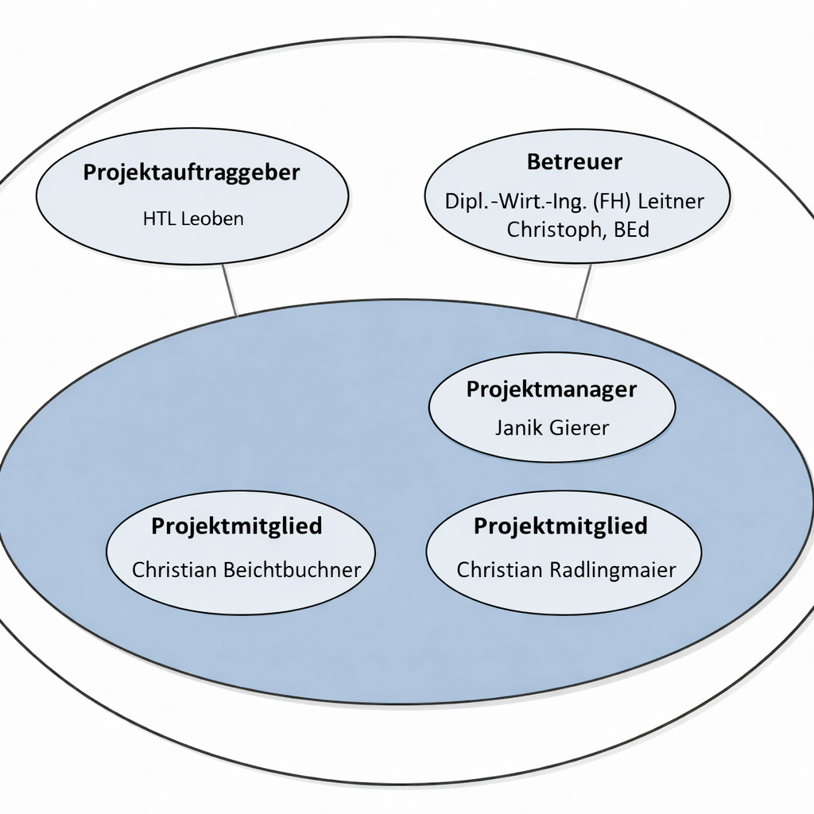

# Projekthandbuch Smart Home Diplomarbeit

**Autor:** Janik Gierer, Christian Radlingmaier, Christian Beichtbuchner
**Stand:** 06.03.2026

## Entwicklungsplan

### Projektauftrag

Im Rahmen unserer Diplomarbeit entwickeln wir ein modellbasiertes Smart-Home-System mit verschiedenen Sensoren und Aktoren. Diese werden über ein zentrales System mit FHEM und Home Assistant verwaltet und gesteuert. Das Projekt befasst sich mit der Automatisierung von Haushaltsprozessen auf einem Miniaturmodellhaus und bietet zusätzlich eine webbasierte Bedienoberfläche über Portainer und Node-RED. Ziel ist es, ein skalierbares, offenes System zu demonstrieren, das mit Protokollen wie MQTT kommuniziert.

### Projektziele

- Aufbau eines funktionstüchtigen Smart-Home-Modellhauses mit realitätsnaher Steuerung.
- Integration von Home Assistant zur Steuerung und Visualisierung.
- Anbindung von Sensoren (Temperatur, Helligkeit, Türkontakt) und Aktoren (Licht, Motoren, Heizung) via MQTT.
- Visualisierung und Bedienung über Node-RED.
- Verwaltung der Containerumgebung über Portainer.
- Dokumentation der Einrichtung und Konfiguration.
- Vorbereitung für später mögliche Erweiterungen wie Fernzugriff oder Spracherkennung.

### Nicht-Ziele

- Keine Entwicklung eigener Sensorhardware (nur Integration vorhandener Komponenten).
- Keine native App-Entwicklung.
- Kein Live-Zugriff von außerhalb ohne VPN oder Portweiterleitung.

### Projektnutzen

- Demonstration moderner Automatisierung im Kleinformat.
- Praxiserfahrung im Umgang mit Containerisierung, MQTT und Home Assistant.
- Anwendbares Wissen für spätere berufliche Aufgaben oder größere Hausautomatisierungen.
- Beitrag zum praxisnahen Unterricht an der HTL Leoben.

### Projektauftraggeber/in

HTL Leoben Abteilung für Informationstechnologie  
Betreuer: Christoph Leitner, BEd., DI (FH) Markus Zacharias

### Projekttermine

| Termin     | Inhalt                          | Status (Stand 06.03.2026) |
|------------|---------------------------------|----------------------------|
| 2025-09-15 | Projektstart und Planung        | Abgeschlossen              |
| 2025-10-10 | Aufbau Smart-Home-Modellhaus   | Abgeschlossen              |
| 2025-10-31 | Systemgrundlagen funktionsfähig | Abgeschlossen              |
| 2025-11-15 | Systemintegration               | Abgeschlossen              |
| 2025-12-15 | Systemtest und Optimierung      | Abgeschlossen              |
| 2026-01-15 | Dokumentation weitgehend fertig | Abgeschlossen              |
| 2026-02-20 | Finalisierung                   | Abgeschlossen              |
| 2026-03-06 | Abgabe Dokumentation            | Fällig heute               |
| März 2026  | Präsentation und Fachgespräch   | Offen                      |

Table: Projekttermine und aktueller Status

### Projektkosten

| Meilenstein | Kostenart      | Menge | Einzelpreis   | Gesamtkosten  | Bezahlt durch |
|-------------|----------------|-------|---------------|---------------|---------------|
| Hardware    | Sensoren       | 6     | 7.00 \euro{}  | 42.00 \euro{} | Schüler      |
| Hardware    | Aktoren        | 4     | 8.00 \euro{}  | 32.00 \euro{} | Schüler      |
| Plattformen | Raspberry Pi   | 1     | 60.00 \euro{} | 60.00 \euro{} | Schule        |
| Haus        | 3D Druck       | 8     | 25.00 \euro{} | 200.00 \euro{}| Schule        |
| Zubehör    | Kabel/Adapter  | 1     | 10.00 \euro{} | 10.00 \euro{} | Schüler      |
| Druckkosten | Dokumentation  | 1     | 25.00 \euro{} | 25.00 \euro{} | Schüler      |

Table: Projektkosten nach Kostenart und Finanzierung

<!-- Genaue Kosten bei finaler Abrechnung prüfen. -->

Gesamtkosten: 369.00 \euro{}

### Projektrisiken

| Risiko                     | Wahrscheinlichkeit | Auswirkungen                         | Maßnahmen                                |
|---------------------------|--------------------|--------------------------------------|-------------------------------------------|
| Hardware beschädigt      | Mittel (30%)       | Ersatz notwendig, Verzögerung möglich | Ersatzgeräte vorrätig halten         |
| WLAN-Probleme             | Niedrig (10%)      | Keine Kommunikation zwischen Modulen | Kabelgebundene Option vorbereiten        |
| MQTT-Verbindungsprobleme  | Mittel (20%)       | Sensoren/Aktoren nicht steuerbar     | Logging, Restart-Mechanismen implementieren |
| Komplexität Home Assistant | Hoch (40%)      | Verzögerung durch Konfigurationsfehler | Schrittweise testen, Dokumentation lesen |

Table: Projektrisiken mit Eintrittswahrscheinlichkeit und Maßnahmen

## Projektorganisation

{ width=100% }

### Projektbeteiligte

| Vorname   | Nachname       | Organisation | Kontaktinfo             |
|-----------|----------------|--------------|-------------------------|
| Janik     | Gierer         | HTL Leoben   | 211wita04@htl-leoben.at |
| Christian | Beichtbuchner  | HTL Leoben   | 211wita01@htl-leoben.at |
| Christian | Radlingmaier   | HTL Leoben   | 211witb21@htl-leoben.at |

Table: Projektbeteiligte mit Organisation und Kontaktinformation

### Projektrollen

| Rolle          | Beschreibung                                          | Name                    |
|----------------|-------------------------------------------------------|-------------------------|
| Projektleiter  | Gesamtkoordination, Umsetzung in Home Assistant       | Janik Gierer            |
| Teammitglied   | Modellierung Modellhaus, Verkabelung im Haus          | Christian Beichtbuchner |
| Teammitglied   | Umsetzung in FHEM                                     | Christian Radlingmaier  |
| Betreuer       | Schulischer Ansprechpartner, techn. Kontrolle         | Christoph Leitner, BEd. |
| Zweitbetreuer  | Zweiter schulischer Ansprechpartner, techn. Kontrolle | DI (FH) Markus Zacharias |

Table: Projektrollen und Zuständigkeiten im Team

### Vorgehen bei Änderungen

- Änderungen werden im GitHub-Repo dokumentiert (Changelog.md).
- Bei größeren Änderungen (z. B. Sensorwechsel) wird der Betreuer informiert.
- Der Projektleiter entscheidet in Absprache mit Team und Betreuer über die Annahme.

## Meilensteine

### 2025-09-15 - Projektstart und Planung abgeschlossen (Status: Abgeschlossen)

- Projektauftrag bestätigt
- Projekthandbuch erstellt und abgestimmt
- Zeitplan gemäß DA-Vorgaben festgelegt
- GitHub-Repository und Grundstruktur eingerichtet

### 2025-10-10 - Aufbau Smart-Home-Modellhaus abgeschlossen (Status: Abgeschlossen)

- Modellhaus mechanisch fertiggestellt
- Grundverkabelung und Stromversorgung umgesetzt
- Sensoren und Aktoren montiert
- Erste Funktionstests durchgeführt

### 2025-10-31 - Systemgrundlagen funktionsfähig (Status: Abgeschlossen)

- Raspberry Pi eingerichtet
- Docker-Umgebung aufgesetzt
- MQTT-Broker funktionsfähig
- Home Assistant gestartet
- Erste Sensordaten werden übertragen

### 2025-11-15 - Systemintegration abgeschlossen (Status: Abgeschlossen)

- Alle Sensoren und Aktoren integriert
- Kommunikation über MQTT stabil
- Node-RED-Flows implementiert
- Grundlegende Automatisierungen laufen

### 2025-12-15 - Systemtest und Optimierung (Status: Abgeschlossen)

- Gesamtsystem im Testbetrieb
- Fehleranalyse durchgeführt
- Optimierungen umgesetzt
- Dashboard und Visualisierung verbessert

### 2026-01-15 - Dokumentation weitgehend fertig (Status: Abgeschlossen)

- Technische Dokumentation erstellt
- Aufbau und Konfiguration beschrieben
- Screenshots und Diagramme ergänzt
- Erweiterungen (z. B. Szenen, Zeitsteuerung) implementiert

### 2026-02-20 - Finalisierung (Status: Abgeschlossen)

- Letzte Systemtests
- Dokumentation korrigiert und formatiert
- Druckversion erstellt
- Präsentation vorbereitet
- Demo-System einsatzbereit

### 2026-03-06 - Offizielle Abgabe der Diplomarbeit (Status: Fällig heute)

- Abgabe der Dokumentation im DA-Portal
- Gedruckte Version wird abgegeben
- Projektstand wird vollständig dokumentiert

### März 2026 - Präsentation und Abschluss (Status: Offen)

- Diplomarbeitspräsentation wird durchgeführt
- Fachgespräch wird absolviert
- Projektabschluss und Reflexion werden abgeschlossen

## Anwendungsfälle

### Überblick

- Smart Home automatisch beleuchten
- Temperaturabhängige Heizsteuerung
- Türkontaktmeldung per Pushnachricht
- Visualisierung der Sensordaten im Dashboard
- Fernsteuerung über Handy (lokales WLAN)
- Zeitschaltfunktionen

### Beispiel: Licht automatisch steuern

#### Kurzbeschreibung

Die Beleuchtung wird bei Dunkelheit automatisch eingeschaltet.

#### Trigger

Helligkeitssensor meldet Dunkelheit.

#### Vorbedingung

System ist gestartet und Sensoren sind einsatzbereit.

#### Nachbedingung

Lampe wird für 2 Minuten eingeschaltet.

#### Akteure

- Benutzer (indirekt)
- Sensoren (Helligkeit)

#### Standardablauf

1. Helligkeit < 200 Lux $\rightarrow$ Bedingung erfüllt
2. Lampe wird via MQTT eingeschaltet

#### Fehlerfälle

- Helligkeit über Schwellwert: Lampe bleibt aus
- Lichtsensor defekt: keine Aktion

#### Systemzustand im Fehlerfall

Licht bleibt aus, Status im Dashboard wird angezeigt.
